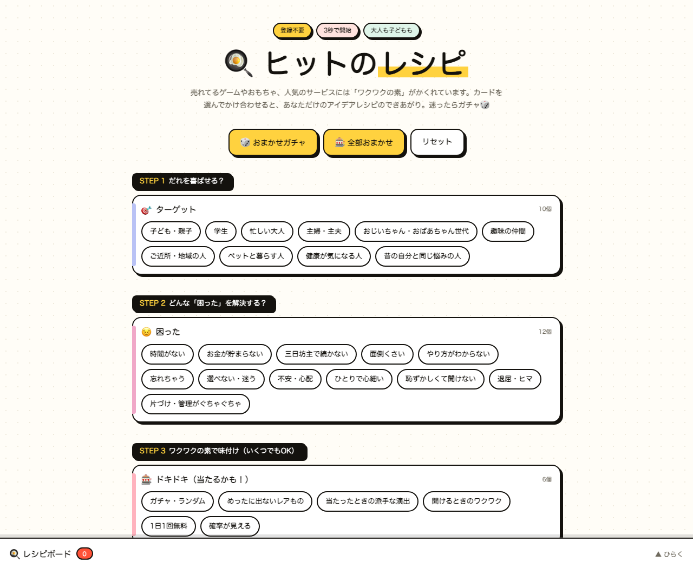

# 🍳 ヒットのレシピ — ワクワクの素 かけ算メーカー

売れてるゲーム・おもちゃ・サービスにかくれている「ワクワクの素」をカードにしました。
カードを選んでかけ合わせるだけで、あなただけのアイデアレシピ文ができあがるブレストツールです。
大人のブレストにも、子どもの自由研究にも。

**▶ 使ってみる: https://kkp-15.github.io/hit-no-recipe/**

## 使い方

1. **STEP 1: だれを喜ばせる？** — ターゲットのカードを選ぶ（10種）
2. **STEP 2: どんな「困った」を解決する？** — ペイン（悩みごと）のカードを選ぶ（12種）
3. **STEP 3: ワクワクの素で味付け** — 「ドキドキ」「集めたくなる」「毎日やりたくなる」など8カテゴリ×6個＝48種のカードから、いくつでも
4. **STEP 4: どうやってお金にする？** — マネタイズのカードを選ぶ（8種）

カードを選ぶと、画面下の**レシピボード**にレシピ文がリアルタイムで書き上がります。

> 「【誰】の『【困った】』を、【要素】×【要素】のかけ合わせで解決するサービス！お金のしくみは【〜】。」

- 🎲 **おまかせガチャ** / 🎰 **全部おまかせ** — 迷ったらランダムでかけ合わせ
- 📖 **レシピ帳に保存** — タイトル＋メモ付きで保存（ブラウザ内に保存されます）
- 📋 **コピー** — AIにそのまま貼れるMarkdown形式でコピー。ChatGPTやClaudeに貼れば、レシピを具体的な企画に育てられます

## 特徴

- **登録不要・無料・インストール不要** — ブラウザで開くだけ
- **単一HTMLファイル** — ビルドなし・フレームワークなしのvanilla JS
- **データは端末の中だけ** — レシピ帳はブラウザのlocalStorageに保存。外部への送信は一切ありません

## ライセンス

[MIT License](LICENSE)
